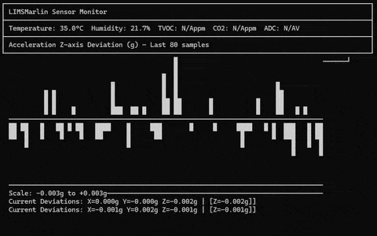

# LIMS Marlin

LIMS-Marlin is an open source, open hardware, peripheral appliance designed to read physical telemetry data from Marlin-based FDM printers and publish the data to a LIMS appliance for storage and analysis.

## Tech Stack

LIMS Marlin uses a custom-built Raspberry Pi shield on top of a Raspberry Pi 4b (a Pi 5 would also work).

The software is written in C#, running on .NET 8.

Peripheral drivers and the core software stack are [using Meadow](http://wildernesslabs.co)